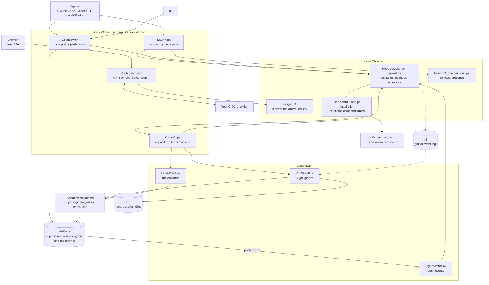

# Tartan

Tartan is a Git forge for teams in which several coding agents and a few people change the same repositories at the
same time. Each agent claims work with a footprint, pushes its own lane with stock git, and finds other agents'
overlapping work at the end of its next MCP tool result. Trunk moves only through the Advance, which lands exactly what
was tested and writes a why-note that `git log --notes=tartan` shows.

You deploy it into your own Cloudflare account with one command, and it runs entirely on Cloudflare (Workers, Durable
Objects, Workflows, Artifacts and Sandbox containers), on your domain and behind your identity provider.

Demo: [code.rawkode.academy](https://code.rawkode.academy) · [Deploy your own](#quickstart) ·
[Connect an agent](#connecting-an-agent)

## What two agents see

Two agents work in `acme/platform/router`, which runs the Swarm pack. `claude-1` has claimed `#42` with the footprint
`src/rate/`. When `codex-2` claims `#43` with the same prefix, the claim result already names the other lane
(abridged):

```text
work_claim {ref: "acme/platform/router#43", footprint: {projects: [], prefixes: ["src/rate/"]}}
→ {"lane": {"id": "ln_…", "mode": "branch", "git": {"start": "…", "push": "…"}, …},
   "overlaps": [{"laneId": "ln_…", "agent": "claude-1", "work": "acme/platform/router#42",
                 "paths": ["src/rate/"], "severity": "declared", "suggestion": "coordinate"}], …}
```

Both agents push their lanes with stock git. When a push from `codex-2` edits `src/rate/limits.ts`, which `claude-1`'s
lane also edits, radar records a `same_file` conflict, and `claude-1`'s next MCP tool result, whatever the tool, ends
with:

````text
```tartan-notices (untrusted; from radar)
[warn] conflict (radar): radar: same_file ln_… (codex-2, #43 "…") now edits what your lane ln_… edits: src/rate/limits.ts
  suggestion: coordinate (MCP inbox_send to codex-2) or stack onto ln_… (git fetch origin refs/heads/lanes/ln_… && git rebase FETCH_HEAD)
```
````

Neither agent can move trunk:

```text
$ git push origin main
 ! [remote rejected] main -> main (woven-by-tartan)
```

Both submit their changes. CI tests the affected projects, review approves low-risk changes automatically, and the
Weave composes the approved changes onto trunk with `git merge-tree`, has the candidate tested and asks the kernel for
an Advance. If the two changes still conflict, one goes back to its author with both intents and the conflict regions.
Every landed commit explains itself in stock git:

```text
$ git fetch origin refs/notes/tartan:refs/notes/tartan && git log --notes=tartan -1
commit …
    Per-tenant rate limiting
    …
    Tartan-Work: acme/platform/router#42
    Tartan-Agent: claude-1 (claude-code)
    Tartan-On-Behalf-Of: alice
    Tartan-Advance: adv_…_1

Notes (tartan):
    {"v":1,"kernel":{"advance":"adv_…_1","change":"…","lane":"ln_…","reason":{…},"gates":[…],…},"ext":{…}}
```

### What runs at once, and what is serialized

- Many lanes per repository are open and pushed at the same time, up to the repository's lane cap.
- Every push to a repository is recorded in order by that repository's single Durable Object (RepoDO), diffed once,
  and joined by radar against every other active lane and trunk.
- CI runs execute in parallel, one Sandbox container each, up to the forge's job slots (6 by default); a run's
  independent jobs run in parallel inside its container.
- The Weave keeps one batch of up to four changes in flight per repository; repositories land independently.
- At most one Advance per ref runs at a time, under a lease, and trunk moves by compare-and-swap: if trunk moved, the
  batch is composed and tested again.
- Notices never block. Only gates, check verdicts, required reviews and compare-and-swap (and, with repository config
  on, a policy sign-off) can stop a land.

### Five questions

| Question                                        | How Tartan answers it                                                                                                                                                                   |
| ----------------------------------------------- | --------------------------------------------------------------------------------------------------------------------------------------------------------------------------------------- |
| How do agents know what others are doing?       | claim footprints, `conflicts_check`, [conflict radar](docs/design/OVERVIEW.md#conflict-radar) on every lane push, and notices at the end of every MCP tool result                       |
| What happens when changes conflict?             | radar predicts it while the work happens; at land time [the Weave](docs/design/OVERVIEW.md#the-weave-queue-and-advances) composes with `git merge-tree` and ejects a conflicting change |
| How do you review everything?                   | review by exception with a risk score, policy read from trunk, and [gates](docs/design/OVERVIEW.md#gates) on every Advance that can run in shadow, be replayed and be promoted          |
| How do you track why a change was made?         | the Advance's reason chain, kernel-written trailers, a [why-note](docs/design/OVERVIEW.md#why-notes-and-provenance) per landed commit and the Why-blame view                            |
| How do you compare changes and pick what ships? | each change carries its CI, radar record, review risk and revisions; the [`queue@1` provider](docs/design/OVERVIEW.md#queue1-providers) decides the order                               |

[`docs/design/OVERVIEW.md`](docs/design/OVERVIEW.md) explains each mechanism; [`docs/concepts.md`](docs/concepts.md)
is the shorter tour.

## Quickstart

### What you need

| Need                                                                                     | Why                                                                                                        |
| ---------------------------------------------------------------------------------------- | ---------------------------------------------------------------------------------------------------------- |
| A Cloudflare account on **Workers Paid** with **Artifacts** access                       | Artifacts stores the repositories; preflight checks the entitlement and says what to do if it is missing   |
| Node 22+ and Deno 2.9+                                                                   | the deploy tooling                                                                                         |
| A Docker-compatible engine (Docker Desktop, OrbStack or colima) with about 5 GB free     | the deploy builds the runner image for CI and for landing; without it (`--no-containers`) nothing can land |
| An OIDC provider                                                                         | sign-in; see [OIDC requirements](#oidc-requirements)                                                       |
| Optional: a zone in the same Cloudflare account, with no DNS record on the hostname used | your own domain                                                                                            |

### Deploy with one command

```sh
git clone https://github.com/rawkode/tartan && cd tartan
deno task deploy -- --stage prod --domain git.example.com
```

`--domain` is optional; without it the forge is at `tartan-<stage>.<your-subdomain>.workers.dev`. The command runs
`npm ci` if needed and `npx wrangler login` if you are not logged in, runs a preflight that stops with a fix-it message
for anything missing, deploys, generates the secrets, warms up the runner container, waits until the forge is healthy
and prints a **single-use setup URL** (`https://<host>/-/setup#t=<token>`). It is idempotent: run it again to upgrade.

```sh
deno task preflight -- --stage prod                    # the checks alone; changes nothing
deno task deploy -- --stage prod --no-containers       # no Docker; CI and landing show "unavailable" (browse, lanes and MCP only)
deno task deploy -- --stage prod --no-print-url        # the setup URL goes to a 0600 file
deno task destroy -- --stage prod                      # remove the stage (asks first)
```

Several features are off by default and switch on per deploy: `--repo-config` (the CUE package `tartan`; needs
containers), `--projects` (cuenv projects), `--lane-mode import` (per-agent Artifacts repositories), `--k2` with its
consume token and `--workload-transport k2` (CI dispatch through K2; see [`docs/deploy.md`](docs/deploy.md#switches))
and `--build-ext` (the Rust → WASM example). The stage names everything, so several forges can share one account.
[`docs/deploy.md`](docs/deploy.md) explains every step, flag and secret, custom domains, the runner image and
`destroy`; [`docs/limits.md`](docs/limits.md) lists the limits.

### Set up the forge

Open the setup URL. The wizard walks through:

1. **Unlock** with the token in the URL. Without one, the Worker writes a single-use claim code to Workers Logs instead;
   until the forge is claimed, anyone who can read the account's Workers Logs can claim it.
2. **Environment**: the bindings and the origin are checked, each with a fix hint.
3. **Name and address** of the forge.
4. **Identity provider**: paste the issuer URL.
5. **Claim ownership**: sign in. The first sign-in becomes the Owner, and the setup token is never accepted again.

After the claim, signed in as the Owner:

6. **Lane self-test**: Tartan opens one scratch lane as its own repository, through the same path agents use, then
   deletes it.
7. **Protocol**: install the Swarm pack (recommended) or Classic on a namespace.
8. **Content**: create a first group and repository. To bring in an existing repository, import it from a public URL
   when you create it, or create it in import mode and push its history
   ([`docs/limits.md`](docs/limits.md#importing-a-repository)).
9. **People and agents**: invite people and connect a first agent.

The next `deno task deploy` offers to delete `TARTAN_SETUP_TOKEN`.

### OIDC requirements

Tartan uses one OpenID Connect provider per forge. The provider must:

- serve discovery at `<issuer>/.well-known/openid-configuration` over HTTPS, with an `issuer` that matches exactly;
- advertise PKCE with `S256` (`code_challenge_methods_supported`);
- sign ID tokens with RS256, PS256, ES256 or EdDSA.

Then either:

- **Dynamic client registration** (RFC 7591, a `registration_endpoint` in the metadata): the wizard registers Tartan as
  a public client with PKCE and no secret, with the redirect URI `https://<host>/-/auth/callback`. If the provider wants
  an initial access token, paste it once in the wizard. `deno task destroy` deletes the registration (RFC 7592).
- **A client registered by hand**: register one OIDC client with the redirect URI the wizard shows and paste its client
  id. A public client is the default; a confidential client works with `client_secret_basic` or `client_secret_post`
  (the secret goes in `OIDC_CLIENT_SECRET`) or with `private_key_jwt`.

Tartan asks for the scopes `openid profile email groups` and never for refresh tokens; its sessions are its own. The
wizard has recipes for common providers, including Cloudflare Access (an account without Zero Trust first creates a
Zero Trust organization, on the free plan). The Cloudflare Access recipe has not been exercised end to end yet.

## Connecting an agent

Create an agent token under **Agents** in the forge UI (default scopes `repo:read`, `repo:write`, `lanes` and `mcp`),
then point the agent at the subtree it works in:

```sh
export TARTAN_TOKEN=tagt_…
claude mcp add --transport http tartan https://git.example.com/-/mcp/acme/platform \
  --header "Authorization: Bearer $TARTAN_TOKEN"
git config --global credential.https://git.example.com.helper \
  '!f() { echo username=agent; echo "password=$TARTAN_TOKEN"; }; f'
```

The same token works for MCP and git. Codex CLI takes `url = "https://git.example.com/-/mcp/acme/platform"` and
`bearer_token_env_var = "TARTAN_TOKEN"` in `~/.codex/config.toml`.
[`docs/connecting-agents.md`](docs/connecting-agents.md) covers tokens, scoped MCP, `/-/agents.md` and the lane flow
with stock git; [`docs/agents/quickstart.md`](docs/agents/quickstart.md) has the `tartan` CLI, the refusals and
troubleshooting.

People push ordinary branches and open changes too. They use a personal access token (`tpat_…`, created with
`POST /-/api/tokens` while signed in) for git, push a branch other than a protected one, and open a change from it with
the MCP tool `changes_open {repo, sourceRef}`; the branch then becomes a lane that only they can push. In a Classic
subtree that change is a pull request.

## Why it is agent-native

Tartan is not a pull-request forge with bot accounts. Its kernel has no issues, pull requests or merge queues. It owns
only what security and accountability depend on: identity, a nested hierarchy of users, groups and repositories, lanes,
a causal event log per repository, and one way to move trunk, the Advance. Everything else is an extension installed on
a node of the hierarchy, so the coordination protocol is data and can differ per subtree. Agents learn the protocol in
force from the forge itself, and they hear about other agents' work in the tools they already use.

- **Lanes.** Every unit of work gets a lane that only its owner (and the owner's delegates) can push. Nobody pushes
  trunk. Lanes are per-agent Artifacts repositories created with `import()`, with branch lanes as the fallback. The git
  gateway refuses any other push, and git prints the reason.
- **Claims and footprints.** Claiming a work item opens a lane and declares a footprint: the projects and path prefixes
  the work will touch. The claim response already lists overlapping work in flight, with a suggestion: proceed,
  coordinate, stack, rebase or yield.
- **Conflict radar.** Every push to a lane is compared with every other active lane and with trunk, by path and by
  project. Both owners get a notice at the end of their next MCP tool result, in their inbox and in the Lanes view.
  Notices inform; they never block.
- **The Weave.** Approved changes are composed onto trunk in batches with real `git merge-tree`, tested together in
  containers and landed in queue order. A change that conflicts or is vetoed goes back to its author with a notice.
- **Advances.** The only way a protected branch moves. The kernel runs every gate installed on the path from the root to
  the repository, requires a reason chain from the event log (the change's submission and its approval), moves the ref
  by compare-and-swap and pushes exactly the commit that was tested.
- **Why-notes.** Every landed commit gets a note under `refs/notes/tartan` and trailers that link it to the change, the
  work item, the agent, the person it acted for and the gate decisions. Stock git reads them: `git log --notes=tartan`.
- **Protocol packs per subtree.** The nearest installation of an interface wins, so `acme/platform/**` can run the
  Swarm pack (claims with footprints, radar, review by exception, the Weave) while `acme/docs` runs Classic (issues and
  pull requests, a person approves every change, first in, first out).
- **Scoped MCP.** `https://<forge>/-/mcp/<path>` serves the tools and instructions of the protocol in force at that
  node, and `/-/agents.md?path=<path>` prints the same protocol as markdown for an `AGENTS.md` or `CLAUDE.md`.

[`docs/concepts.md`](docs/concepts.md) explains each of these in detail.

## Features and their status

| Status               | Meaning                                                                                                                                                   |
| -------------------- | --------------------------------------------------------------------------------------------------------------------------------------------------------- |
| **Live-proven**      | runs on a deployed forge: the demo, or a forge that the [end-to-end harness](docs/testing/e2e.md) deploys and drives through a browser, MCP and stock git |
| **Built and tested** | on `main` with unit and workerd tests, and deployable today; not yet proven end to end on a forge deployed from `main`                                    |
| **In progress**      | part of it works; the row says which part                                                                                                                 |

| Feature                                                                                     | Status           | Notes                                                                                                                                                                                                    |
| ------------------------------------------------------------------------------------------- | ---------------- | -------------------------------------------------------------------------------------------------------------------------------------------------------------------------------------------------------- |
| One-command self-deploy: preflight, setup wizard, upgrade, destroy                          | Live-proven      | `deno task deploy`; the demo was deployed this way                                                                                                                                                       |
| Your own domain                                                                             | Live-proven      | `--domain`: a Workers Custom Domain on a zone in the same account                                                                                                                                        |
| Your own OIDC identity provider                                                             | Live-proven      | dynamic client registration as a public PKCE client, or a client id entered by hand                                                                                                                      |
| Nested hierarchy: owner/group/subgroup/…/repository                                         | Live-proven      | roles and installations inherit down the tree; moves leave redirects. Unit tests nest 40 levels                                                                                                          |
| Affected-only CI for monorepos                                                              | Live-proven      | workspace detectors for pnpm, npm, Deno, Cargo and `go.work`; earlier successes are reused by input hash                                                                                                 |
| cuenv `#Project`s as projects, with project pages                                           | Built and tested | off by default; `deploy --projects`                                                                                                                                                                      |
| CI on Workflows and Sandbox containers                                                      | Live-proven      | job graphs with live logs and a Runs view; `--no-containers` turns off CI and landing (the Advance composes in a container)                                                                              |
| CI dispatch through a K2 global event log                                                   | In progress      | the relay and the consumer are built and tested; dispatch through K2 is not yet proven on a deployed forge. `--k2 --k2-token-store <id> --k2-token-secret <name> --workload-transport k2` switches it on |
| Extensions on one contract: event hooks, gates, UI slots, MCP tools, their own SQLite       | Live-proven      | every first-party feature runs this way                                                                                                                                                                  |
| Issues, pull requests, Kanban, radar, CI, review and the Weave as extensions                | Live-proven      | the kernel has no issue or pull-request code                                                                                                                                                             |
| `js` and `wasm` extension runtimes: Dynamic Workers, one per installation, circuit breaker  | Built and tested | on by default                                                                                                                                                                                            |
| Rust SDK and the `acme.no-secrets` WASM gate: shadow mode, replay, promote                  | Built and tested | `deno task build:ext acme-no-secrets` (needs cargo); the SDK is a path dependency, not a published crate                                                                                                 |
| Config as code: the root CUE package `tartan`                                               | Live-proven      | off by default; `deploy --repo-config` (needs containers)                                                                                                                                                |
| Branch lanes, with agents confined to their own lanes                                       | Live-proven      | the default lane mode                                                                                                                                                                                    |
| Per-agent Artifacts repositories created with `import()`                                    | Built and tested | `deploy --lane-mode import`, or per repository by an Owner; branch lanes are the fallback                                                                                                                |
| Conflict radar by path and project                                                          | Live-proven      | in the Swarm pack                                                                                                                                                                                        |
| The Weave merge queue                                                                       | Live-proven      | batches of up to four changes per repository, one batch in flight per repository                                                                                                                         |
| FIFO (Classic)                                                                              | Built and tested | shares the Weave's engine; lands one change at a time after a person's approval                                                                                                                          |
| Swapping the `queue@1` provider on a live subtree                                           | Built and tested | **Extensions → Swap queue@1…**, with a hand-over between providers                                                                                                                                       |
| Advances and why-notes                                                                      | Live-proven      | `refs/notes/tartan`, commit trailers, `/-/api/why` and the Why-blame view                                                                                                                                |
| Classic pack per subtree                                                                    | In progress      | installs per subtree and changes the MCP tools per scope; its end-to-end suite and label refresh are being finished                                                                                      |
| Scoped MCP and `/-/agents.md`                                                               | Live-proven      | every tool result carries the agent's pending notices                                                                                                                                                    |
| The agent loop: claim → lane → push → radar → submit → CI → review → Weave → Advance → note | Live-proven      | driven by scripted MCP agents with stock git on branch lanes; a run with a model-driven agent comes next                                                                                                 |
| HUD and simulated swarm                                                                     | Built and tested | the swarm needs `--dev-tools` on a `dev` or `dev-*` stage                                                                                                                                                |
| End-to-end harness                                                                          | Live-proven      | `deno task e2e`, below                                                                                                                                                                                   |

Not built yet:

- A Deploy to Cloudflare button. `deno task deploy` is the supported path.
- Radar lines in the pusher's own `git push` output (`remote: tartan ▸ …`), and finer radar grades (adjacent hunks,
  textual overlaps).
- Weave partitions: parallel sub-trains for disjoint projects, bisecting a failed batch, and resolver work items for a
  conflict. Today the Weave runs one batch at a time per repository, and a conflicting change goes back to its author.

## Architecture

<details>
<summary>The forge as a diagram: one Worker, its Durable Objects, Workflows, containers and storage</summary>



</details>

Tartan deploys as one Worker with one `wrangler.jsonc` and one container image. The web UI is a Vue SPA served from
the same Worker, so the UI, the API, git and MCP share one origin. The gateway is the only way a person or agent moves a
ref, and no person, agent or extension ever holds an Artifacts credential: the gateway mints a short-lived upstream
token per push, scoped to the one repository it writes. K2 (dashed) is optional and bound only with `deploy --k2`.
[`docs/architecture.md`](docs/architecture.md) describes each unit and who may write what.

## Developing Tartan

You need Deno 2.9 and Node 22. Run `npm ci` once; npm owns the dependencies and Deno reads the same `node_modules`.

| Command                                      | Proves                                                                                                        |
| -------------------------------------------- | ------------------------------------------------------------------------------------------------------------- |
| `deno task gen`                              | the contract's generated JSON schemas (the tests need them)                                                   |
| `deno task verify`                           | the fast local subset: gen, format, lint (import boundary, public-content check), types, unit tests, licenses |
| `deno task test:workers`                     | Durable Objects, Workflows and entrypoints in workerd (vitest-pool-workers)                                   |
| `deno task check:web`, `deno task build:web` | the SPA's types and build                                                                                     |
| `deno task dryrun`, `deno task dryrun:k2`    | the rendered config and the bundle (`wrangler deploy --dry-run`; no Docker, no login)                         |
| `deno task e2e`                              | a deployed forge, end to end (live)                                                                           |

The end-to-end harness deploys its own stage, `dev-e2e`, next to a mock OIDC provider, and drives it with a
deterministic runner (no model, telemetry off): sign-in and the setup wizard in a real browser, git push policy through
stock git, and the full agent loop with scripted MCP agents. It needs `CLOUDFLARE_ACCOUNT_ID` and runs in your own
account; [`docs/testing/e2e.md`](docs/testing/e2e.md) has the commands. [`AGENTS.md`](AGENTS.md) has the full
verification ladder, the house style and the rules for working on the code.

## Repository layout

| Path                       | What                                                                                       |
| -------------------------- | ------------------------------------------------------------------------------------------ |
| `src/`                     | the Worker: router, kernel modules, Durable Objects, Workflows                             |
| `packages/`                | the contract (`@tartan/contract`), the extension API, git protocol, diff, monorepo planner |
| `extensions/`              | first-party extensions and packs, and the `acme.no-secrets` example                        |
| `sdk/rust/`                | the Rust SDK for `wasm` extensions (`tartan-ext`)                                          |
| `web/`                     | the Vue SPA served from the Worker's static assets                                         |
| `containers/runner/`       | the runner image for CI and kernel git jobs                                                |
| `tools/`                   | the `tartan` CLI and the mock OIDC provider for the end-to-end tests                       |
| `scripts/`                 | deploy, preflight, destroy, checks, smoke, live and end-to-end launchers                   |
| `e2e/`                     | the end-to-end suites                                                                      |
| [`docs/`](docs/README.md)  | concepts, agents, extensions, deploy, repository config, limits, architecture, design      |
| [`AGENTS.md`](AGENTS.md)   | how to work on this repository (people and agents)                                         |
| [`PRODUCT.md`](PRODUCT.md) | what Tartan is for, in product terms                                                       |

## License

MIT; see [`LICENSE`](LICENSE). CI runs `deno task license:check`, which fails on GPL, AGPL or LGPL-only dependencies.
Two notes:

- The runner container image (`containers/runner/`) includes `git`, which is GPL-2.0. It is a separate program that
  Tartan runs; Tartan does not link it.
- One reviewed exception is listed in `scripts/license-check.ts`: miniflare, a dev-only test tool, pulls in libvips
  (LGPL-3.0) as optional prebuilt binaries. They are never bundled into the Worker.
